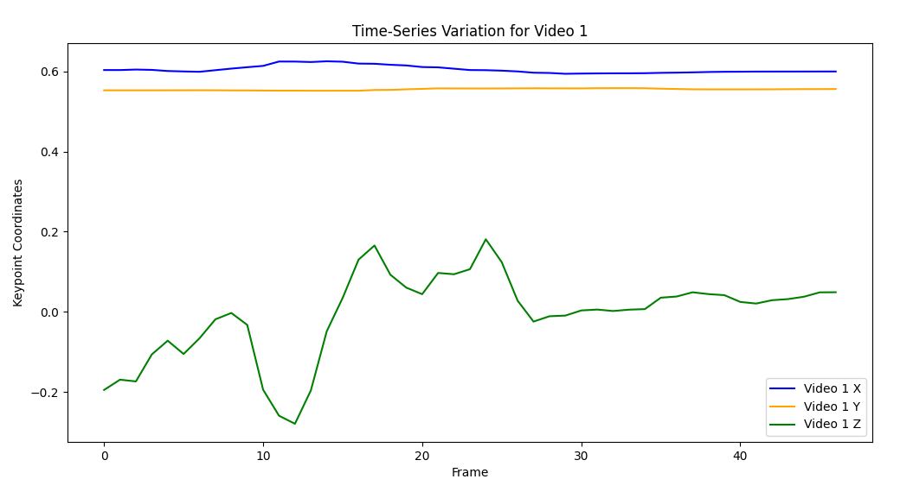
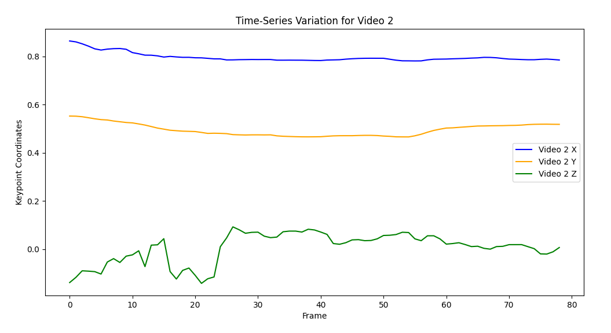
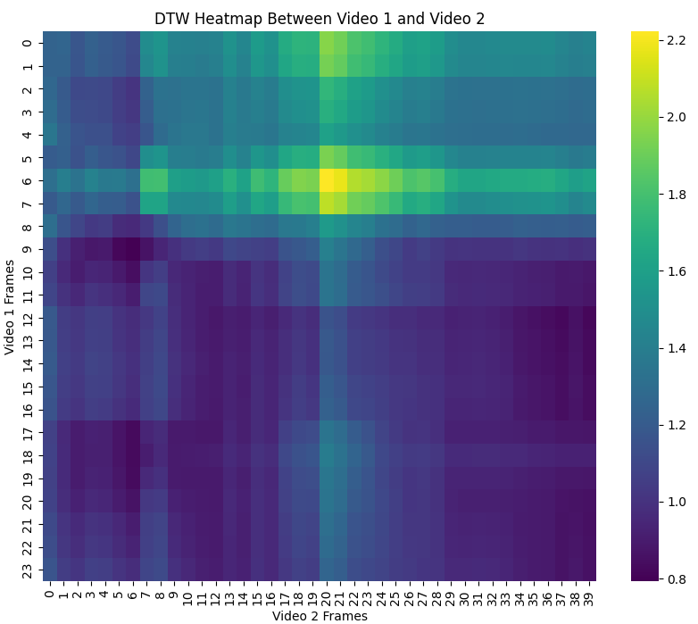
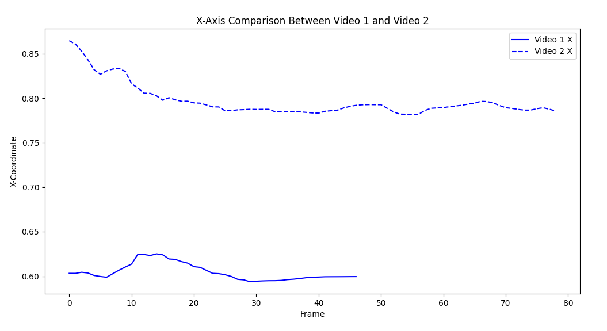
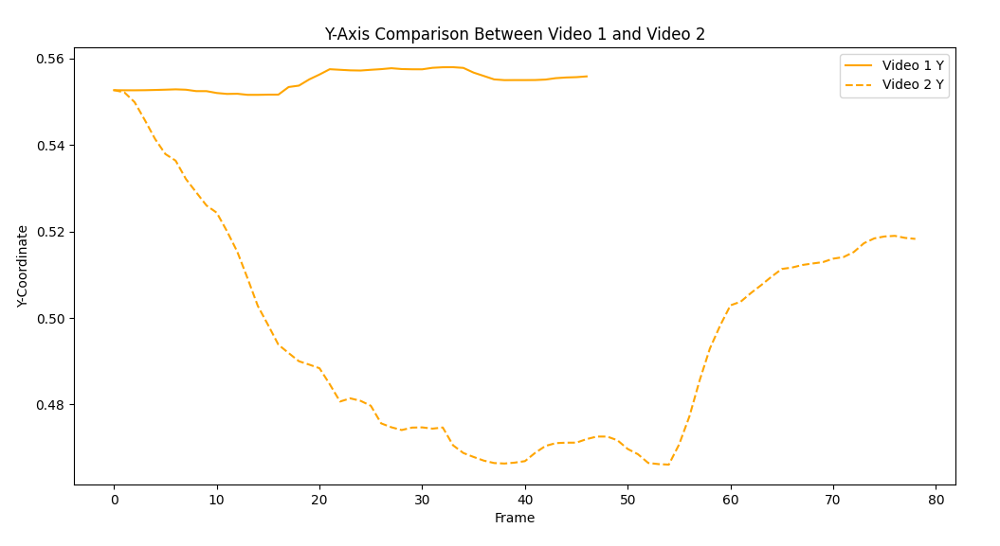
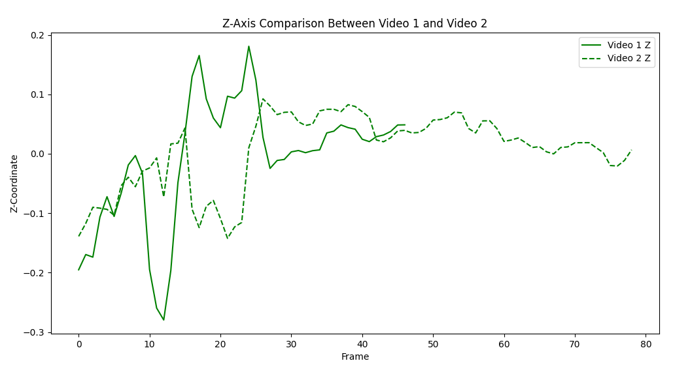
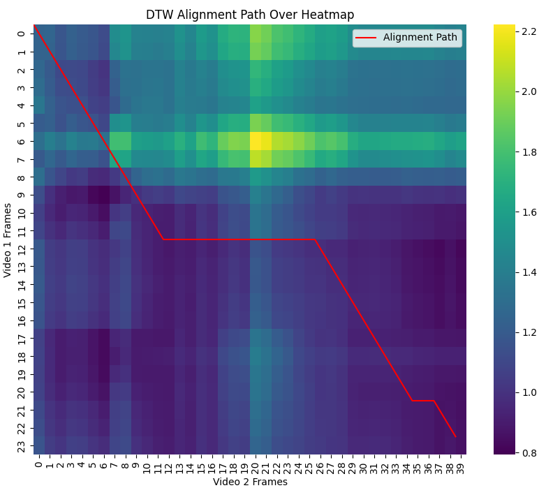
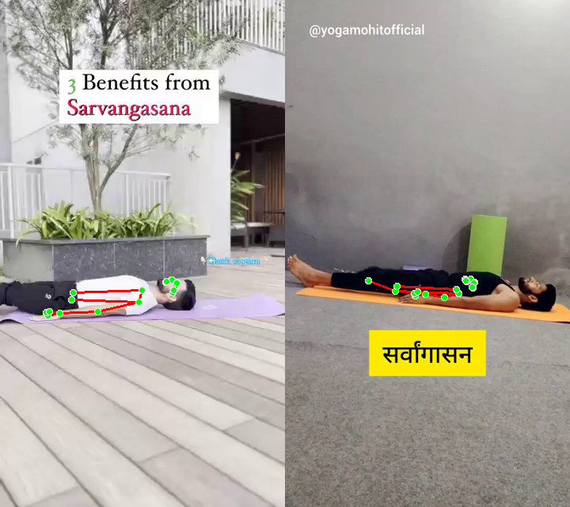
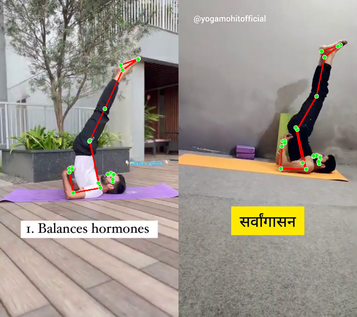
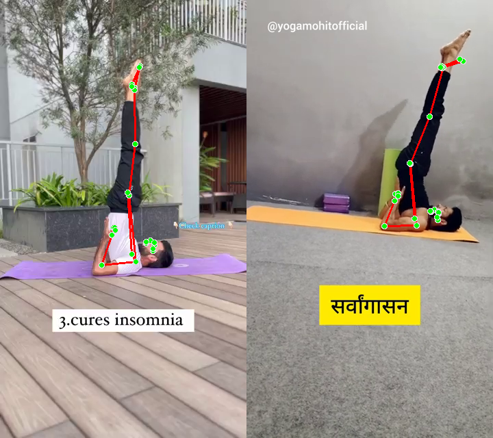

# Time-Series Variation Analysis:

## Video 1 (First Plot):

Shows relatively stable X and Y coordinates (blue and orange lines) around 0.6 and 0.55 respectively

The Z coordinate (green line) shows more dramatic variation:

1. Initial gradual increase from -0.2 to 0
2. Sharp dip around frame 10-15
3. Two distinct peaks around frames 20 and 25
4. Stabilizes after frame 30 around 0.05

## Video 2 (Second Plot):

Higher X coordinate values (blue line) around 0.8, very stable throughout

Y coordinates (orange line) stable around 0.5

Z coordinate (green line) shows similar pattern to Video 1 but:

1. Less dramatic variations
2. More stable after frame 25

## DTW Alignment Path Heatmap (Third Plot):

1. Shows the Dynamic Time Warping alignment between the two videos
2. The diagonal dark blue line indicates a good temporal alignment between the sequences
3. Distance measure of 40.2 suggests moderate similarity
4. The straight diagonal pattern suggests consistent timing between the two videos without major temporal distortions

# Coordinate-wise Analysis

## X-Axis Comparison
- Video 1 maintains a relatively stable position around 0.60
- Video 2 shows higher values, starting at 0.85 and gradually decreasing to stabilize around 0.79
- The difference in X-coordinates suggests a consistent spatial offset between the two videos
- Both videos show minimal fluctuation after the initial frames, indicating steady horizontal positioning

## Y-Axis Comparison
- Video 1 demonstrates remarkable stability, maintaining a near-constant position around 0.55
- Video 2 shows a distinctive downward trend:
  - Starts at approximately 0.55
  - Gradually decreases to about 0.47 by frame 40
  - Shows recovery after frame 60, rising back to around 0.52
- The diverging patterns suggest different vertical motion patterns between the two videos

## Z-Axis Comparison
- Most dynamic axis showing significant variations in both videos
- Video 1 shows:
  - Sharp dip around frame 12 (reaching -0.28)
  - Two prominent peaks around frames 15 and 22
  - Stabilization after frame 30
- Video 2 demonstrates:
  - More gradual variations
  - General upward trend until frame 25
  - More stable behavior in later frames
  - Less extreme fluctuations compared to Video 1

# DTW Analysis

## Alignment Characteristics
- The red path in the DTW alignment shows how frames from both videos correspond
- Notable features:
  - Strong diagonal trend indicating overall temporal correspondence
  - Several horizontal segments suggesting temporary pauses or slower movement in Video 2
  - Darker purple regions indicating stronger similarity between corresponding frames
  - Lighter (yellower) regions in the upper portion showing greater differences in early frames

## Key Observations
1. The alignment path shows three distinct phases:
   - Initial phase : Rapid diagonal progression
   - Middle phase : More varied alignment with some horizontal segments
   - Final phase : More consistent alignment with longer horizontal segments

2. The heatmap background reveals:
   - Higher dissimilarity (yellower regions) in early frames
   - Increasing similarity (darker purple) as the sequences progress
   - Most stable matching in the later portions of both videos

These visualizations collectively suggest that while the two videos capture similar movements, they differ in their execution speed and spatial positioning, with Video 2 showing generally smoother and more gradual changes compared to Video 1.
And in the initial phase of the video these are dissimilar after may be 2 seconds to 6 seconds.

## Some points where both videos are very similar  in terms of movements and other aspects as well

  

Also check video(ouput.avi).

## Key Findings:

1. **Motion Similarities**  
   - Both videos capture foundational movements with distinct execution styles.  
   - Despite differences in scale and perspective, they exhibit synchronized phases, indicating structured, intentional motion.

2. **Coordinate Stability and Variations**  
   - **X-axis:** Displays consistent positional offset (~0.2 units) across videos.  
   - **Y-axis:** Stability in Video 1 contrasts with a U-shaped pattern in Video 2.  
   - **Z-axis:** Video 1 has sharper peaks, while Video 2 demonstrates smoother, gradual transitions, highlighting different execution styles.

3. **Temporal Characteristics**  
   - Video 1 is shorter (~45 frames) with dynamic transitions, while Video 2 is longer (~80 frames) and more stable.  
   - Alignment improves progressively, with three distinct phases: variation, transition, and stabilization.

4. **Dynamic Time Warping (DTW) Insights**  
   - Good temporal alignment despite absolute value differences, with dissimilarity reducing significantly over time (3.5 to 1.0).  
   - Later frames show stronger synchronization, with Video 2 exhibiting temporal pauses that aid alignment.

5. **Movement Execution Differences**  
   - Video 1 demonstrates sharper, more extreme movements, especially on the Z-axis.  
   - Video 2 features smoother, more controlled transitions, reflecting a longer, refined motion pattern.

6. **Spatial Relationships**  
   - Horizontal (X-Y) plane shows consistent offsets, while vertical (Z) patterns diverge.  
   - Depth (Z-axis) movements correlate strongly in the later frames, suggesting improved alignment over time.

7. **Evolution of Patterns**  
   - Initial frames exhibit the highest variability.  
   - Middle frames reflect a transition toward alignment.  
   - Final frames achieve the strongest synchronization and correspondence.

