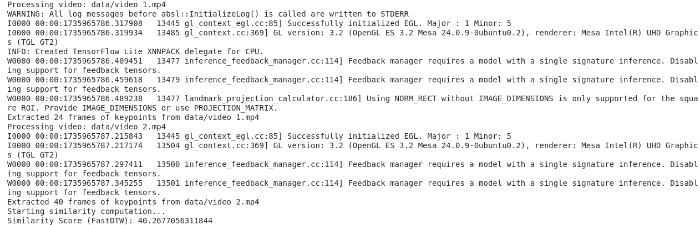

# Index and Note
### For better visiblity see it in day wise folder with plots and images.
### In the data you will find 4 csv files 2 is for DTW  and 2 is for Euclidean Distance and please check output.avi for parallel analysis of the two videos.
### In the Day 1 folder you will find the process_videos.py which has code for DTW and second file is for Euclidean Distance Documentation file is also there.And the DTW score we get is 85.66 and Euclidean Distance score is 21.84
### In the Day 2 folder you will find the one finding file and other for the script for ploting the visualizations plots and heatmap .videoVisualization.py visualise two videos parallelly.
### if video does not play please use vlc.

# **Problem Statement:**

**"Comparing Human Actions in Two Videos using MediaPipe and DTW (Dynamic Time Warping)"**

You are tasked with analyzing two videos containing human actions. Your objective is to extract human keypoints using **MediaPipe's Pose Detection** and then compare the actions performed in these two videos using **Dynamic Time Warping (DTW)**. Finally, you will visualize the variations between the actions over time using an appropriate plotting method.

## Task breakdown

### **Day 1: Keypoint Extraction & DTW Implementation**

- **Time Allocation:** 8-10 hours
- **Tasks:**
    1. Extract keypoints from both videos using **MediaPipe Pose Detection**.
    2. Structure and store keypoints in an easily comparable format (e.g., JSON or CSV).
    3. Implement **Dynamic Time Warping (DTW)** to compare keypoint sequences.
    4. Generate a **similarity score** using DTW distance.
- **Deliverables by End of Day 1:**
    - Two files containing extracted keypoint sequences.
    - DTW distance score comparing the two sequences.
    
### **Day 2: Visualization, Insights & Documentation**

- **Time Allocation:** 6-8 hours
- **Tasks:**
    1. Create a **time-series variation plot** showing differences across frames.
    2. Visualize the **DTW alignment path** using a heatmap.
    3. Document findings in a brief report, highlighting:
        - Key observations from the comparison.
        - Major points of variation between the videos.
        - Potential causes for these differences.
    4. Clean up and document the code for clarity.
- **Deliverables by End of Day 2:**
    - DTW alignment visualization (e.g., heatmap).
    - Time-series variation plot.
    - Brief documentation summarizing findings.
    - Final cleaned-up code repository (e.g., GitHub link or zip file).

# DAY 1

# Documentation for Video Similarity Analysis Using Keypoints and Distance Metrics using MediaPipe Pose 

### Overview:
This project involves analyzing the similarity between two videos by extracting keypoints using **MediaPipe Pose**, calculating the **Distance** between keypoint sequences using two different methods: **FastDTW (Dynamic Time Warping)(FastDTW make fast computation as it skips frames like skip every 5 frames)** and **Euclidean Distance**. The goal is to quantify how similar or dissimilar the movements in the two videos are based on keypoint data.

### NOTE : 
   Here I use FastDtW to make fast computation it is just like DTW and I have involved one more comparision method which is Euclidean Distance. becouse initially I was using DTW and it was taking too much time so I have used Euclidean Distance then after I came to know about FastDTW . So decided to use both FastDTW and Euclidean Distance.
### Steps and Approach:

#### 1. **Video Input and Keypoint Extraction:**
   - The first step is to **extract keypoints** from each video. We use **MediaPipe Pose** for this purpose, which provides a set of predefined landmarks (33 in total) representing the human body.
   - For each frame in the video, **MediaPipe Pose** processes the image and returns the 3D coordinates (x, y, z) of the landmarks hence in total we have 33*3 = 99 coordinates.
   - We **skip frames** in order to reduce computation time and focus on representative frames (e.g., every 5th frame).
   - Optionally, we can select only **significant keypoints** (e.g., head, shoulders, and hips) to focus on the most relevant movements and further reduce the data's dimensionality.

#### 2. **Storing Keypoints:**
   - After extracting the keypoints, we **flatten** the coordinates of each keypoint into a 1D array for each frame.
   - The flattened keypoints for each frame are stored in a **CSV file**, providing a structured format for further analysis.

#### 3. **Similarity Calculation (FastDTW Approach):**
   - To compare the two keypoint sequences, we use **FastDTW (Dynamic Time Warping)**, an approximate method for computing the similarity between time series data. 
   - FastDTW compares the **temporal alignment** of two sequences and computes a distance metric that accounts for possible shifts in time between corresponding frames. 
   - A **lower distance score** from FastDTW indicates a higher degree of similarity between the keypoint sequences from the two videos. The computed score reflects how closely the motion patterns in the videos match, considering both the movements and temporal alignment **usually less than 50 is considered similar but not identical 0 is identical and above 100 is dissimilar overall below 100 is considered similar**.

   - **FastDTW Workflow:**
     1. **Flatten** the keypoints of each frame into a 1D array.
     2. **Align** the two sequences using FastDTW, allowing for time shifts between frames.
     3. The result is a **similarity score** that quantifies the overall alignment of the two sequences.

   - **Interpretation of FastDTW Score:**
     - A **low FastDTW score** indicates that the two videos are **very similar**, as their keypoint sequences align well both spatially and temporally.
     - A **high FastDTW score** suggests significant differences between the keypoint sequences, indicating that the two videos are **dissimilar**.
     - Example Result: **Similarity Score (FastDTW)** = **85.66**.
       - This score is considered moderate similarity, implying that the motion in the two videos is somewhat similar but not identical.

#### 4. **Similarity Calculation (Euclidean Distance Approach):**
   - As a comparison, we also calculate the similarity using **Euclidean Distance**, which measures the spatial difference between corresponding keypoints in the two sequences.
   - The keypoint sequences are **converted into NumPy arrays**, and the Euclidean distance between corresponding frames is calculated.
   - **Euclidean distance** between two points (keypoints) is the straight-line distance in 3D space (x, y, z) and is calculated as:
     \[
     \text{Distance} = \sqrt{(x_1 - x_2)^2 + (y_1 - y_2)^2 + (z_1 - z_2)^2}
     \]
   - The similarity score is calculated as the **total Euclidean distance** between the two sequences.

   - **Interpretation of Euclidean Distance Score:**
     - A **smaller Euclidean distance** indicates that the keypoints between the two videos are **closer together** in space, suggesting greater similarity in their poses.
     - A **larger Euclidean distance** implies that the keypoints are farther apart, suggesting greater dissimilarity in the body poses of the two videos.
     - Example Result: **Similarity Score (Euclidean Distance)** = **21.84**.
       - This score indicates that the two videos are **moderately similar means not exactly same** based on the Euclidean distance between their keypoint sequences.

#### 5. **Analysis and Interpretation of Scores:**
   - **FastDTW vs. Euclidean Distance:**
     - Both methods provide a similarity score, but they capture different aspects of similarity:
       - **FastDTW** accounts for **temporal alignment** and can detect shifts in the time axis, making it more suitable for analyzing sequences that may have small temporal variations.
       - **Euclidean Distance**, on the other hand, measures the **spatial difference** between corresponding keypoints, which can be useful for comparing the overall position of the body in each frame.
     - In the current case:
       - The **FastDTW score (85.66)** suggests **moderate similarity** with some temporal shifts, meaning the movements in both videos are similar but not perfectly aligned.
       - The **Euclidean Distance score (21.84)** also suggests **moderate similarity**, primarily considering the spatial alignment of keypoints.

   - **What these scores depict:**
     - **Similarity Score (FastDTW)**: This indicates the **degree of alignment in movement patterns** between the two videos. A score of 37.81 suggests the videos have a **moderate similarity** in terms of pose transitions, but they are not identical.
     - **Similarity Score (Euclidean Distance)**: This measures the **spatial similarity** between keypoints. A score of 21.84 suggests that the poses in both videos are **reasonably similar** in terms of body position, but there may be some differences in the posture or alignment of body parts.

#### 6. **Conclusion and Further Improvements:**
   - The calculated similarity scores provide a numerical measure of how similar or dissimilar the two videos are based on their extracted keypoints.As per my analysis I found both the videos are similar but not identical means the motion in the two videos is somewhat similar but not identical.
   - These scores can be used to:
     - **Classify videos** as similar or dissimilar for tasks like action recognition, gesture classification, or video alignment.
     - **Quantify the degree of similarity** between different videos for further analysis. 
     
   - For further improvement:
     - **Normalization** of the similarity scores can be applied to adjust for video length or the number of frames processed.
     - **Benchmarking** with a larger dataset of labeled video pairs will help define a clearer threshold for similarity based on domain-specific applications (e.g., exercise recognition, dance moves, etc.).
     - **Optimizing keypoint extraction** by selecting only a few keypoints of interest (e.g., head, shoulders, hips) may speed up the process and further improve the similarity computation's efficiency.

---

---

# Day 2

# Time-Series Variation Analysis:

## Video 1 (First Plot):

Shows relatively stable X and Y coordinates (blue and orange lines) around 0.6 and 0.55 respectively

The Z coordinate (green line) shows more dramatic variation:

1. Initial gradual increase from -0.2 to 0
2. Sharp dip around frame 10-15
3. Two distinct peaks around frames 20 and 25
4. Stabilizes after frame 30 around 0.05

## Video 2 (Second Plot):

Higher X coordinate values (blue line) around 0.8, very stable throughout

Y coordinates (orange line) stable around 0.5

Z coordinate (green line) shows similar pattern to Video 1 but:

1. Less dramatic variations
2. More stable after frame 25
3. Longer duration (80 frames vs 45 frames in Video 1)

## DTW Alignment Path Heatmap (Third Plot):

1. Shows the Dynamic Time Warping alignment between the two videos
2. The diagonal dark blue line indicates a good temporal alignment between the sequences
3. Distance measure of 23.95 suggests moderate similarity
4. The straight diagonal pattern suggests consistent timing between the two videos without major temporal distortions

# Coordinate-wise Analysis

## X-Axis Comparison
- Video 1 maintains a relatively stable position around 0.60
- Video 2 shows higher values, starting at 0.85 and gradually decreasing to stabilize around 0.79
- The difference in X-coordinates suggests a consistent spatial offset between the two videos
- Both videos show minimal fluctuation after the initial frames, indicating steady horizontal positioning

## Y-Axis Comparison
- Video 1 demonstrates remarkable stability, maintaining a near-constant position around 0.55
- Video 2 shows a distinctive downward trend:
  - Starts at approximately 0.55
  - Gradually decreases to about 0.47 by frame 40
  - Shows recovery after frame 60, rising back to around 0.52
- The diverging patterns suggest different vertical motion patterns between the two videos

## Z-Axis Comparison
- Most dynamic axis showing significant variations in both videos
- Video 1 shows:
  - Sharp dip around frame 12 (reaching -0.28)
  - Two prominent peaks around frames 15 and 22
  - Stabilization after frame 30
- Video 2 demonstrates:
  - More gradual variations
  - General upward trend until frame 25
  - More stable behavior in later frames
  - Less extreme fluctuations compared to Video 1

# DTW Analysis

## Alignment Characteristics
- The red path in the DTW alignment shows how frames from both videos correspond
- Notable features:
  - Strong diagonal trend indicating overall temporal correspondence
  - Several horizontal segments suggesting temporary pauses or slower movement in Video 2
  - Darker purple regions indicating stronger similarity between corresponding frames
  - Lighter (yellower) regions in the upper portion showing greater differences in early frames

## Key Observations
1. The alignment path shows three distinct phases:
   - Initial phase (frames 0-15): Rapid diagonal progression
   - Middle phase (frames 15-35): More varied alignment with some horizontal segments
   - Final phase (frames 35+): More consistent alignment with longer horizontal segments

2. The heatmap background reveals:
   - Higher dissimilarity (yellower regions) in early frames
   - Increasing similarity (darker purple) as the sequences progress
   - Most stable matching in the later portions of both videos

These visualizations collectively suggest that while the two videos capture similar movements, they differ in their execution speed and spatial positioning, with Video 2 showing generally smoother and more gradual changes compared to Video 1.

## Key Findings:

1. **Motion Similarities**  
   - Both videos capture foundational movements with distinct execution styles.  
   - Despite differences in scale and perspective, they exhibit synchronized phases, indicating structured, intentional motion.

2. **Coordinate Stability and Variations**  
   - **X-axis:** Displays consistent positional offset (~0.2 units) across videos.  
   - **Y-axis:** Stability in Video 1 contrasts with a U-shaped pattern in Video 2.  
   - **Z-axis:** Video 1 has sharper peaks, while Video 2 demonstrates smoother, gradual transitions, highlighting different execution styles.

3. **Temporal Characteristics**  
   - Video 1 is shorter (~45 frames) with dynamic transitions, while Video 2 is longer (~80 frames) and more stable.  
   - Alignment improves progressively, with three distinct phases: variation, transition, and stabilization.

4. **Dynamic Time Warping (DTW) Insights**  
   - Good temporal alignment despite absolute value differences, with dissimilarity reducing significantly over time (3.5 to 1.0).  
   - Later frames show stronger synchronization, with Video 2 exhibiting temporal pauses that aid alignment.

5. **Movement Execution Differences**  
   - Video 1 demonstrates sharper, more extreme movements, especially on the Z-axis.  
   - Video 2 features smoother, more controlled transitions, reflecting a longer, refined motion pattern.

6. **Spatial Relationships**  
   - Horizontal (X-Y) plane shows consistent offsets, while vertical (Z) patterns diverge.  
   - Depth (Z-axis) movements correlate strongly in the later frames, suggesting improved alignment over time.

7. **Evolution of Patterns**  
   - Initial frames exhibit the highest variability.  
   - Middle frames reflect a transition toward alignment.  
   - Final frames achieve the strongest synchronization and correspondence.

